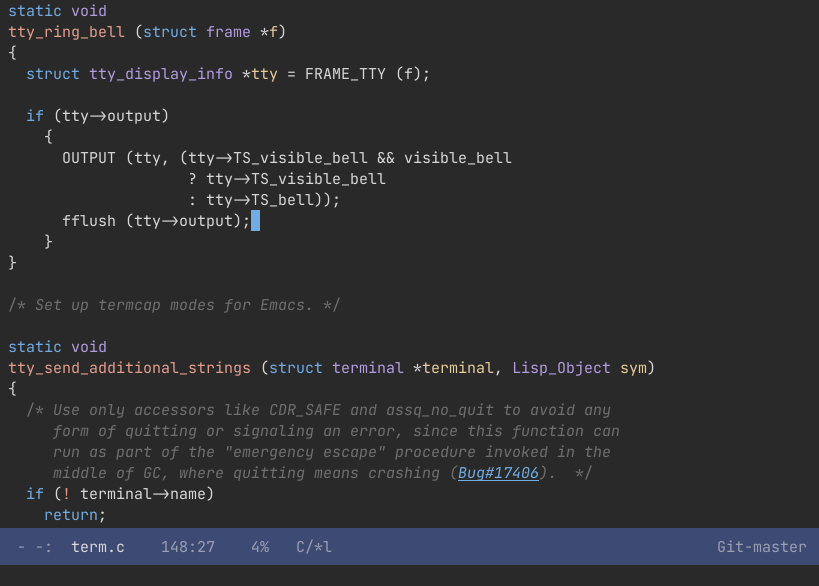
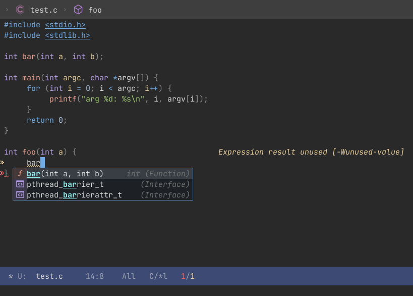
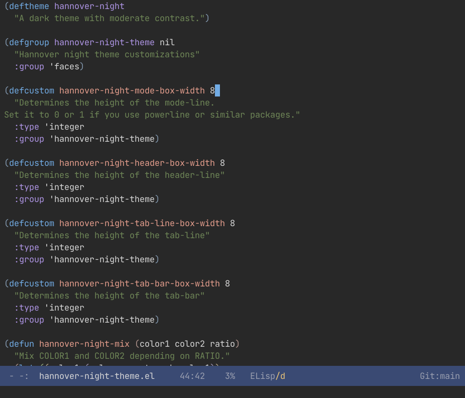
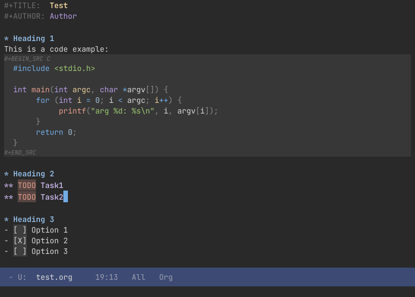

#+TITLE: Hannover Emacs Themes
#+AUTHOR: Florian Rommel
#+LANGUAGE: en

Light and dark Emacs themes with moderate contrast.
Provides carefully crafted faces for lots of packages.

Colors and some other aspects of the theme can be configured
(See the hannover-theme group).

* Installation

** Installation with use-package

Starting with GNU Emacs Version 29.1, [[https://www.gnu.org/software/emacs/manual/html_node/use-package/][use-package]] was built into Emacs, and with
it, the [[https://www.gnu.org/software/emacs/manual/html_node/use-package/Install-package.html][:vc]] keyword, which — for the first time — allowed users to declare and
manage packages directly from version-controlled repositories without needing an
external package manager such as [[https://github.com/progfolio/elpaca][elpaca.el]] or [[https://github.com/radian-software/straight.el][straight.el]].

*** Latest Release

Install the latest release of ~hannover-theme~ — the last commit that bumped the
"Version" tag inside of the main Emacs Lisp file — and load the ~hannover-day~
theme.

#+BEGIN_SRC emacs-lisp
(use-package hannover-theme
  :if (version<= "29.1" emacs-version)
  :vc (:url "https://github.com/florommel/hannover-night-theme" :branch "main")
  :ensure t
  :config (load-theme 'hannover-day))
#+END_SRC

*** Most Recent Commit

Install the most recent commit of ~hannover-theme~ — à la [[https://melpa.org/#/][MELPA]] — and load the
~hannover-night~ theme.

#+BEGIN_SRC emacs-lisp
(use-package hannover-theme
  :if (version<= "29.1" emacs-version)
  :vc (:url "https://github.com/florommel/hannover-night-theme" :rev :newest)
  :ensure t
  :config (load-theme 'hannover-night t))
#+END_SRC

*** Upgrading After Installation

After installing ~hannover-theme~ with ~use-package~ and the ~:vc~ keyword,
~hannover-theme~ can be upgraded a few different ways.

Upgrading all packages:

#+BEGIN_SRC
M-x package-upgrade-all RET
#+END_SRC

Upgrading all packages installed with ~use-package~ and the ~:vc~ keyword:

#+BEGIN_SRC
M-x package-vc-upgrade-all RET
#+END_SRC

Explicitly upgrading ~hannover-theme~:

#+BEGIN_SRC
M-x package-vc-upgrade RET hannover-theme RET
#+END_SRC

Upgrading ~hannover-theme~ every time you start Emacs:

#+BEGIN_SRC emacs-lisp
(use-package hannover-theme
  :if (version<= "29.1" emacs-version)
  :vc (:url "https://github.com/florommel/hannover-night-theme" :rev :newest)
  :ensure t
  :init (package-vc-upgrade 'hannover-theme)
  :config (load-theme 'hannover-night t))
#+END_SRC

** Manual Installation from Git

Clone this repository:

#+BEGIN_SRC shell
git clone git://github.com/florommel/hannover-theme.git
#+END_SRC

Add one of the following to your ~user-init-file~:

#+BEGIN_SRC emacs-lisp
(add-to-list 'custom-theme-load-path "/path/to/the/cloned/theme/")
(add-to-list 'load-path "/path/to/the/cloned/theme/")
(load-theme 'hannover-night t) ; hannover-day, hannover-midnight
#+END_SRC

#+BEGIN_SRC emacs-lisp
(use-package hannover-theme
  :load-path "/path/to/the/cloned/theme/"
  :ensure t
  :config (load-theme 'hannover-night t)) ; hannover-day, hannover-midnight
#+END_SRC

* Tips

You can customize the colors and other parameters.
Have a look at the ~hannover-theme~ group.

If you use ~powerline~ or similar packages, you might want to set
~hannover-night-mode-box-width~ to 0 or 1.

* Supported Packages

tab-line, tab-bar, powerline, window-divider, term, eshell, multiple
cursors, dired, diredfl, dired-filter, magit, diff, diff-hl,
git-gutter, wgrep, avy, anzu, ivy/swiper, selectrum, vertico,
orderless, show-paren, compilation, display-line-numbers, company,
company-posframe, popup, corfu, rainbow-delimiters, highlight,
highlight-changes, symbol-overlay, bookmark, bm, sh, auctex, outline,
org, hyperbole, devdocs, markdown, flymake, Flyspell, Flycheck,
writegood, hexl, imenu-list, ledger, neotree, goggles, tree-sitter,
eglot, lsp, treemacs, yascroll, which-func, minimap, hideshowvis,
persp
